# Agentic Knowledge Base Builder

Build modular agents that plan and write documentation for your projects.

```mermaid
graph TD
    A["📁 Codebase/Repository"] --> B["🔍 Content Reader"]
    B --> C["📋 Planner Agent"]
    C --> D["📄 Documentation Outline"]
    D --> E["✍️ Writer Agents"]
    E --> F["📖 Knowledge Base Chapters"]

    subgraph "Agent System"
        C["📋 Planner Agent<br/>Gemini 2.5 Flash"]
        E["✍️ Writer Agents<br/>Gemini 2.0 Flash"]
    end

    subgraph "Output Structure"
        F --> G["chapter_100.md<br/>(Overview)"]
        F --> H["chapter_110.md<br/>(Section 1.1)"]
        F --> I["chapter_120.md<br/>(Section 1.2)"]
        F --> J["chapter_200.md<br/>(Chapter 2)"]
    end

    style A fill:#e1f5fe
    style C fill:#fff3e0
    style E fill:#f3e5f5
    style F fill:#e8f5e8
```




## Commands

```bash
python -m venv venv
source venv/bin/activate
pip install -r requirements.txt

# Run

# Default path is ./data
# Default size limit (1M characters or ~250K tokens)
python main.py

# Set custom size limit (4M characters or ~1M tokens)
python main.py --path ./data --max-size 4000000

```

## Process log

Example result:

```bash
2025-06-10 00:03:58.473 | INFO     | __main__:main:70 - Running documentation builder
2025-06-10 00:03:58.474 | INFO     | __main__:call_agents:42 - Found existing docs_plan.json, skipping planner step
2025-06-10 00:03:58.475 | INFO     | src.writer:construct_writer_agents:101 - Skipping chapter_100.md because it already exists.
2025-06-10 00:03:58.475 | INFO     | src.writer:construct_writer_agents:101 - Skipping chapter_200.md because it already exists.
2025-06-10 00:03:58.475 | INFO     | src.writer:construct_writer_agents:123 - Set up a writing agent for: ## 3. Core CRM Entities -> chapter_300.md
2025-06-10 00:03:58.475 | INFO     | src.writer:construct_writer_agents:123 - Set up a writing agent for: ### 3.1. CRM Touchpoint (`dim_crm_touchpoint`) -> chapter_310.md
2025-06-10 00:03:58.475 | INFO     | src.writer:construct_writer_agents:123 - Set up a writing agent for: ### 3.2. CRM Person (`dim_crm_person`, `fct_crm_person`) -> chapter_320.md
2025-06-10 00:03:58.475 | INFO     | src.writer:sequential_writing_pipeline:159 - Writing chapters...
2025-06-10 00:04:23.148 | INFO     | src.writer:sequential_writing_pipeline:164 - Finished chapter_300.md.
2025-06-10 00:04:36.404 | INFO     | src.writer:sequential_writing_pipeline:164 - Finished chapter_310.md.
2025-06-10 00:04:53.610 | INFO     | src.writer:sequential_writing_pipeline:164 - Finished chapter_320.md.
```


## References

* [Gemini Models](https://ai.google.dev/gemini-api/docs/models)
* [Agent Development Kit](https://google.github.io/adk-docs/)
* [Multi-agent System](https://google.github.io/adk-docs/agents/multi-agents/)