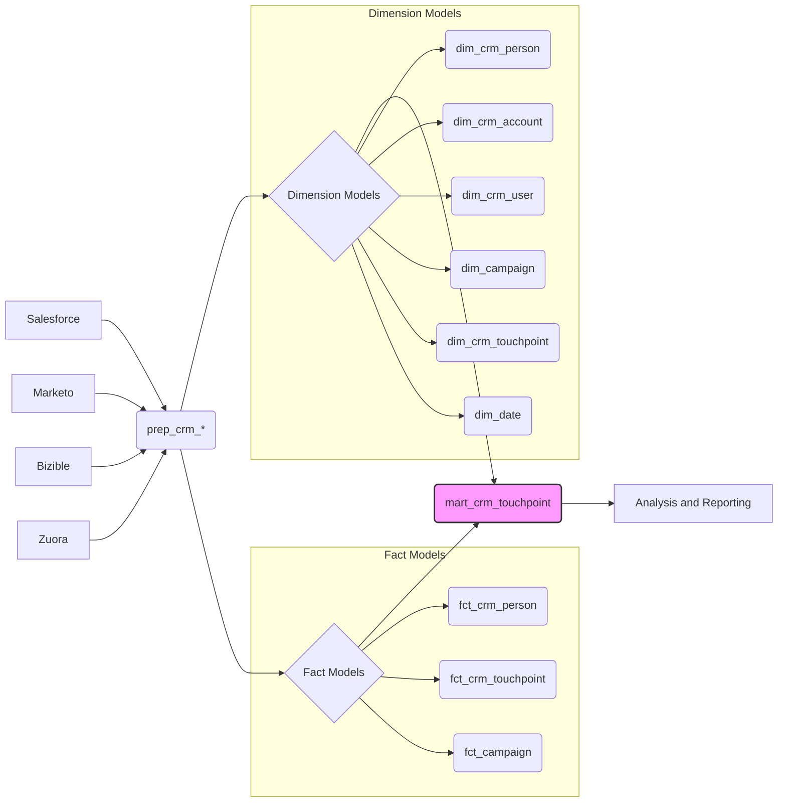

# 1. Overview of the CRM Touchpoint Data Model

This document provides a comprehensive overview of the GitLab CRM Touchpoint Data Model. This model is designed to unify data from various sources such as Salesforce, Marketo, Bizible, and Zuora. By centralizing this information, we gain the ability to perform in-depth analysis of marketing performance, customer journey, and sales attribution. The CRM Touchpoint Data Model acts as the analytical hub for understanding the impact of marketing activities across the entire sales funnel.

## 1.1. Motivation

The primary motivation behind the CRM Touchpoint Data Model is to overcome data silos. Data relevant to the customer journey resides in different systems, making it difficult to get a holistic view of marketing and sales performance. By integrating these data sources into a unified model, we can answer questions such as:

*   Which marketing campaigns are most effective at generating MQLs?
*   What is the average customer journey length from first touch to conversion?
*   How does content engagement influence sales outcomes?
*   Which touchpoints are most influential in driving revenue?

Without a unified model, answering these questions requires complex manual data manipulation and is prone to errors. The CRM Touchpoint Data Model eliminates these challenges by providing a single source of truth.

## 1.2. Core Areas Covered

The GitLab CRM Touchpoint Data Model encompasses several key areas:

*   **Detailed Marketing Touchpoint Information:** Captures granular data about every interaction a prospect or customer has with GitLab's marketing efforts.
*   **Comprehensive Customer and Account Profiles:** Provides rich demographic, firmographic, and engagement data for individuals and the organizations they belong to.
*   **Campaign Performance Metrics:** Tracks the effectiveness of marketing campaigns in terms of reach, engagement, and conversion.
*   **Underlying Data Preparation and Mapping Logic:** Documents the ETL processes and data transformations used to create the model, ensuring transparency and maintainability.

## 1.3. Target Audience

This documentation is primarily intended for data consumers who need to access and analyze CRM data. This includes:

*   Marketing analysts
*   Sales operations teams
*   Data scientists
*   Business intelligence developers

The goal is to empower these users with a clear understanding of the data structure, definitions, and relationships within the model, enabling them to perform self-service analysis and reporting.

## 1.4. Central Use Case: Analyzing Campaign Influence on MQL Generation

Let's consider a central use case: analyzing how different marketing campaigns influence MQL (Marketing Qualified Lead) generation. Using the CRM Touchpoint Data Model, a marketing analyst can:

1.  **Identify all touchpoints associated with individuals who became MQLs:** The `mart_crm_touchpoint` table joins `dim_crm_touchpoint` with `fct_crm_person` to link touchpoint data to individuals and their MQL status.
2.  **Analyze the campaigns associated with those touchpoints:** The `mart_crm_touchpoint` table includes `dim_campaign_id`, allowing analysts to connect touchpoints to specific campaigns.
3.  **Calculate the number of MQLs generated by each campaign:** By aggregating the data in `mart_crm_touchpoint`, analysts can determine which campaigns are most effective at driving MQLs.
4.  **Segment the MQLs by touchpoint characteristics:** Using fields like `bizible_marketing_channel` and `touchpoint_offer_type`, analysts can further refine their analysis to understand which channels and content types are most effective for MQL generation.

This use case demonstrates the power of the CRM Touchpoint Data Model to unify disparate data and provide actionable insights into marketing performance.

## 1.5. Data Flow Diagram

The following diagram illustrates the flow of data from source systems through the data preparation and modeling stages, culminating in the `mart_crm_touchpoint` table.

The diagram highlights the core entities involved in the model:

*   **Persons:** Leads and Contacts in Salesforce.
*   **Accounts:** Organizations associated with Persons.
*   **Users:** GitLab employees (sales and marketing).
*   **Campaigns:** Marketing initiatives.
*   **Touchpoints:** Interactions between Persons and GitLab.

These entities are interconnected through various relationships, enabling a comprehensive understanding of the customer journey. The final `mart_crm_touchpoint` table serves as the central point for analysis and reporting.
