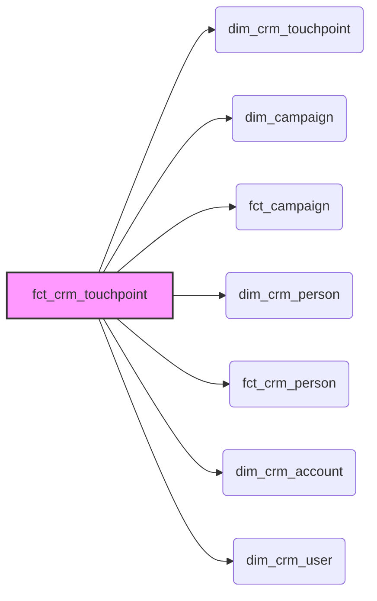

## 2. The Core Analytical Model: `mart_crm_touchpoint`

The `mart_crm_touchpoint` table is the cornerstone of the GitLab CRM Touchpoint Data Model. It addresses the challenge of fragmented CRM data by providing a unified, analytical-ready view of all marketing and sales touchpoints. This model allows data consumers to understand the complete customer journey, perform sophisticated attribution modeling, and gain actionable insights into marketing effectiveness.

**Central Use Case:** A marketing analyst wants to understand which marketing channels are most effective at driving Marketing Qualified Leads (MQLs). They need to analyze touchpoint data, considering the sequence of interactions a person has with GitLab before becoming an MQL. The `mart_crm_touchpoint` table enables this analysis by consolidating touchpoint information with person-level attributes and attribution flags.

### 2.1. Purpose and Value

The `mart_crm_touchpoint` model serves the following key purposes:

*   **Data Unification:** Integrates data from disparate sources like Salesforce, Marketo, Bizible, and Zuora into a single table.
*   **Customer Journey Analysis:** Provides a chronological view of touchpoints, enabling the analysis of customer interactions over time.
*   **Attribution Modeling:** Supports various attribution models by providing the necessary data for calculating touchpoint influence on key milestones (e.g., inquiry, MQL, accepted).
*   **Performance Analysis:** Facilitates the evaluation of marketing channel and campaign performance.

The primary value of this model lies in its ability to provide a holistic understanding of the customer journey, enabling data-driven decision-making in marketing and sales.

### 2.2. Key Fields

The `mart_crm_touchpoint` table contains a rich set of fields, providing granular details about each touchpoint and its context. Here's a breakdown of some of the essential columns:

*   **`dim_crm_touchpoint_id`:**  A unique identifier for each touchpoint, linking to the detailed touchpoint information in the `dim_crm_touchpoint` table (see [3.5. `dim_crm_touchpoint`](chapter_350.md)).
*   **`touchpoint_person_campaign_date_id`**: A unique ID based on the dim_crm_person, dim_campaign and bizible_touchpoint_date_time IDs to ensure uniqueness in the model.

    ```sql
    md5(cast(coalesce(cast(fct_crm_touchpoint.dim_crm_person_id as TEXT), '_dbt_utils_surrogate_key_null_') || '-' || coalesce(cast(dim_campaign.dim_campaign_id as TEXT), '_dbt_utils_surrogate_key_null_') || '-' || coalesce(cast(dim_crm_touchpoint.bizible_touchpoint_date_time as TEXT), '_dbt_utils_surrogate_key_null_') as TEXT)) AS touchpoint_person_campaign_date_id,
    ```
*   **`bizible_touchpoint_date_time`:** The date and time of the touchpoint.
*   **`bizible_touchpoint_position`:** Indicates the position of the touchpoint in the customer journey (e.g., First Touch, Lead Creation Touch).
*   **`bizible_marketing_channel_path`:** The marketing channel path associated with the touchpoint (e.g., Paid Search.Google AdWords).
*   **`utm_campaign`:** The UTM campaign parameter, used for tracking campaign performance.

    *   Parsed components: The `utm_campaign` field is often parsed into more granular components like `utm_campaign_date`, `utm_campaign_region`, `utm_campaign_budget`, etc., providing more detailed insights into campaign targeting and characteristics.
*   **`integrated_campaign_grouping`:** A higher-level grouping of campaigns, enabling analysis at a more aggregated level.
*   **`gtm_motion`:** Indicates the Go-To-Market (GTM) motion associated with the touchpoint (e.g., Self-Service, Channel).
*   **`is_dg_influenced`, `is_dg_sourced`:** Flags indicating whether the touchpoint was influenced by or sourced from Demand Generation efforts.
*   **`is_fmm_influenced`, `is_fmm_sourced`:** Flags indicating whether the touchpoint was influenced by or sourced from Field Marketing efforts.
*   **`count_inquiry`, `count_mql`, `count_accepted`:**  Counts of inquiries, MQLs, and accepted leads associated with the touchpoint, used for attribution analysis.

    ```sql
     CASE
        WHEN dim_crm_touchpoint.bizible_touchpoint_position LIKE '%LC%'
          AND dim_crm_touchpoint.bizible_touchpoint_position NOT LIKE '%PostLC%'
          THEN 1
        ELSE 0
      END AS count_inquiry,
      CASE
        WHEN fct_crm_person.mql_date_first >= dim_crm_touchpoint.bizible_touchpoint_date
          THEN 1
        ELSE 0
      END AS count_mql,
      CASE
        WHEN fct_crm_person.accepted_date >= dim_crm_touchpoint.bizible_touchpoint_date
          THEN 1
        ELSE '0'
      END AS count_accepted,
    ```

### 2.3. Joining Logic

The `mart_crm_touchpoint` table is built by joining data from several dimension and fact tables. Understanding the joining logic is crucial for interpreting the data and ensuring accurate analysis.



*   **`fct_crm_touchpoint`:** This fact table contains the core attribution counts associated with each touchpoint and serves as the starting point for the join. It's joined to:
    *   **`dim_crm_touchpoint`:** on `fct_crm_touchpoint.dim_crm_touchpoint_id = dim_crm_touchpoint.dim_crm_touchpoint_id` to bring in detailed touchpoint attributes.
    *   **`dim_campaign`:** on `fct_crm_touchpoint.dim_campaign_id = dim_campaign.dim_campaign_id` to add campaign information.
    *   **`fct_campaign`:** on `fct_crm_touchpoint.dim_campaign_id = fct_campaign.dim_campaign_id` to include campaign performance metrics.
    *   **`dim_crm_person`:** on `fct_crm_touchpoint.dim_crm_person_id = dim_crm_person.dim_crm_person_id` to add person-level attributes.
    *   **`fct_crm_person`:** on `fct_crm_touchpoint.dim_crm_person_id = fct_crm_person.dim_crm_person_id` to include person-level lifecycle dates and metrics.
    *   **`dim_crm_account`:** on `fct_crm_touchpoint.dim_crm_account_id = dim_crm_account.dim_crm_account_id` to add account-level information.
    *   **`dim_crm_user`:** on `fct_crm_touchpoint.dim_crm_user_id = dim_crm_user.dim_crm_user_id` to add sales rep information.
*   Additional joins include:
    *   Joining `dim_crm_user` a second time (aliased as `campaign_owner`) on `fct_campaign.campaign_owner_id = campaign_owner.dim_crm_user_id` to provide details about the campaign owner.

### 2.4. Attribution Calculations

Several fields in `mart_crm_touchpoint` are derived through attribution calculations, providing insights into the influence and source of touchpoints.

*   **`is_fmm_influenced`:** This flag is set to 1 if the touchpoint is associated with a Field Marketing Manager (FMM) or if the campaign or lead source indicates field event involvement.

    ```sql
    CASE
        WHEN dim_campaign.budget_holder = 'fmm'
              OR campaign_rep_role_name = 'Field Marketing Manager'
              OR LOWER(dim_crm_touchpoint.utm_content) LIKE '%field%'
              OR LOWER(dim_campaign.type) = 'field event'
              OR LOWER(dim_crm_person.lead_source) = 'field event'
          THEN 1
        ELSE 0
      END AS is_fmm_influenced,
    ```
*   **`is_fmm_sourced`:**  This flag is set to 1 if the touchpoint is a "First Touch" and `is_fmm_influenced` is also 1.

    ```sql
    CASE
        WHEN dim_crm_touchpoint.bizible_touchpoint_position LIKE '%FT%'
          AND is_fmm_influenced = 1
          THEN 1
        ELSE 0
      END AS is_fmm_sourced,
    ```
*   **`integrated_budget_holder`:** This field categorizes touchpoints based on the marketing team responsible for the campaign budget. The field uses UTM parameters, campaign details, and ad campaign names from the sources to determine the right budget holder.

    ```sql
    CASE
      WHEN LOWER(dim_campaign.budget_holder) = 'fmm'
        THEN 'Field Marketing'
      WHEN LOWER(dim_crm_touchpoint.utm_budget) = 'dmp'
        THEN 'Digital Marketing'
      ...
    END AS integrated_budget_holder,
    ```

### 2.5. Weighted Touchpoints

To support more sophisticated attribution models, the `mart_crm_touchpoint` table includes fields for weighting touchpoints based on their proximity to the MQL (Marketing Qualified Lead) milestone.

*   **`pre_mql_touches`:**  A count of all touchpoints a person had *before* becoming an MQL.
*   **`pre_mql_weight`:** A weight assigned to each touchpoint before the MQL date, calculated as `1 / pre_mql_touches`.  Touchpoints occurring after the MQL date have a weight of 0.

    The logic is as follows:

    1.  **Count Pre-MQL Touchpoints:** Count the number of touchpoints for each person that occurred before their MQL date.

        ```sql
        WITH count_of_pre_mql_tps AS (
            SELECT DISTINCT
              joined.email_hash,
              COUNT(DISTINCT joined.dim_crm_touchpoint_id) AS pre_mql_touches
            FROM joined
            WHERE joined.mql_date_first IS NOT NULL
              AND joined.bizible_touchpoint_date <= joined.mql_date_first
            GROUP BY 1
        )
        ```
    2.  **Calculate Pre-MQL Weight:** Calculate the weight for each pre-MQL touchpoint.

        ```sql
        , pre_mql_tps_by_person AS (
            SELECT
              count_of_pre_mql_tps.email_hash,
              count_of_pre_mql_tps.pre_mql_touches,
              1/count_of_pre_mql_tps.pre_mql_touches AS pre_mql_weight
            FROM count_of_pre_mql_tps
            GROUP BY 1,2
        )
        ```
    3.  **Assign Weights to Touchpoints:** Assign the calculated weights to the appropriate touchpoints.  Post-MQL touchpoints are assigned a weight of 0.

        ```sql
        , pre_mql_tps AS (
            SELECT
              joined.dim_crm_touchpoint_id,
              pre_mql_tps_by_person.pre_mql_weight
            FROM pre_mql_tps_by_person
            LEFT JOIN joined
              ON pre_mql_tps_by_person.email_hash=joined.email_hash
            WHERE joined.mql_date_first IS NOT NULL
              AND joined.bizible_touchpoint_date <= joined.mql_date_first
        )
        ```

        ```sql
        , post_mql_tps AS (
            SELECT
              joined.dim_crm_touchpoint_id,
              0 AS pre_mql_weight
            FROM joined
            WHERE joined.bizible_touchpoint_date > joined.mql_date_first
              OR joined.mql_date_first IS null
        )
        ```

        ```sql
        , mql_weighted_tps AS (
            SELECT *
            FROM pre_mql_tps
            UNION ALL
            SELECT *
            FROM post_mql_tps
        )
        ```

        ```sql
        ,final AS (
          SELECT
            joined.*,
            mql_weighted_tps.pre_mql_weight
          FROM joined
          LEFT JOIN mql_weighted_tps
            ON joined.dim_crm_touchpoint_id=mql_weighted_tps.dim_crm_touchpoint_id
          WHERE joined.dim_crm_touchpoint_id IS NOT NULL
        )
        ```
This weighting scheme allows for more nuanced attribution modeling, where touchpoints closer to the MQL milestone are given more credit.
