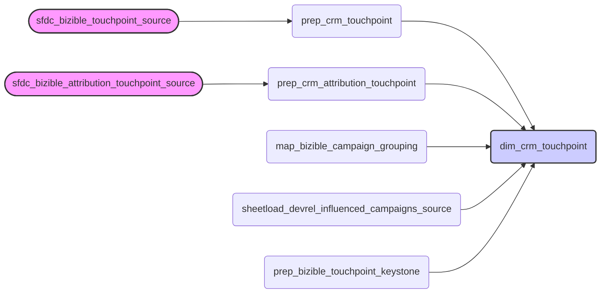

### 3.1. CRM Touchpoint (`dim_crm_touchpoint`)

The `dim_crm_touchpoint` table is a cornerstone of marketing analytics, providing detailed descriptive attributes for each marketing touchpoint. It acts as a single source of truth for understanding how and where customer interactions occur, enriched with valuable marketing metadata derived from UTM parameters and other sources. This table eliminates the need to sift through raw data, offering a clean and standardized view of marketing interactions.

**Central Use Case:** Imagine a marketing analyst needs to understand the performance of a specific campaign, identified by its UTM code, across different marketing channels. The `dim_crm_touchpoint` table allows the analyst to quickly filter touchpoints by `utm_campaign` and then segment them by `bizible_marketing_channel` to see which channels are most effective for that campaign.

*   **Problem**: Without a centralized and cleaned table, identifying and categorizing marketing touchpoints requires complex parsing and joining of data from multiple sources, leading to inconsistencies and increased analysis time.

*   **Solution**: The `dim_crm_touchpoint` table pre-processes and standardizes touchpoint data, providing a single, reliable source for marketing interaction attributes.

**Key Benefits:**

*   **Standardized Touchpoint Attributes**: Consistent data across all touchpoints, regardless of source.
*   **Enriched Marketing Metadata**: UTM parameters are parsed and readily available for analysis.
*   **Channel Grouping**: Touchpoints are categorized into meaningful channel groupings for high-level reporting.
*   **De-duplicated Records**: Ensures accurate counts and avoids double-counting of interactions.

#### Purpose

The primary purpose of the `dim_crm_touchpoint` table is to provide a detailed, de-duplicated record of every marketing interaction, enriched with parsed UTM parameters and derived channel groupings.

#### Source Models

The `dim_crm_touchpoint` table is not built from a single source, but rather through a combination of data preparation and mapping models:

*   **Primary Sources**:
    *   [prep_crm_touchpoint](chapter_421.md): Cleans and categorizes raw Bizible touchpoint data.
    *   [prep_crm_attribution_touchpoint](chapter_422.md): Similar to `prep_crm_touchpoint`, but focuses on attribution touchpoints.
*   **Enrichment Models**:
    *   [map_bizible_campaign_grouping](chapter_422.md): Groups touchpoints into integrated campaign groupings.
    *   `sheetload_devrel_influenced_campaigns_source`: A sheetload table that marks campaigns influenced by the DevRel team.
    *   [prep_bizible_touchpoint_keystone](chapter_424.md): Maps touchpoints to internal 'Keystone' content.

The data flow can be visualized as follows:



#### Key Fields

The `dim_crm_touchpoint` table contains a variety of fields, providing a comprehensive view of each touchpoint. Some of the most important fields include:

*   `dim_crm_touchpoint_id`: A unique identifier for each touchpoint.
*   `bizible_touchpoint_date`: The date of the touchpoint interaction.
*   `bizible_touchpoint_type`: The type of touchpoint (e.g., Web Form, Web Chat, etc.).
*   `bizible_touchpoint_position`: The position of the touchpoint in the customer journey (e.g., First Touch, Lead Creation).
*   `bizible_marketing_channel`: The marketing channel associated with the touchpoint (e.g., Paid Search, Email).
*   `bizible_marketing_channel_path`: A more detailed path describing the marketing channel.
*   `utm_campaign`: The UTM campaign parameter.
*   `utm_source`: The UTM source parameter.
*   `utm_medium`: The UTM medium parameter.
*   `utm_content`: The UTM content parameter.
*   `utm_campaign_date`, `utm_campaign_region`, `utm_content_offer`: Parsed components of the `utm_campaign` and `utm_content` parameters.
*   `integrated_campaign_grouping`: A categorization of the campaign based on touchpoint and campaign attributes.
*   `gtm_motion`: A classification of the "Go-To-Market" motion associated with the touchpoint.
*   `touchpoint_segment`: A high-level segmentation of the touchpoint (e.g., Demand Gen).
*   `pipe_name`: A derived name for the touchpoint, used for reporting.
*   `is_dg_influenced`: A flag indicating if the touchpoint was influenced by the Demand Generation team.
*   `is_devrel_influenced_campaign`: Indicates if the campaign is identified as DevRel influenced.
*   `keystone_content_name`: Links the touchpoint to internal 'Keystone' content.

Here's an example of how these fields might be used in a query:

```sql
SELECT
    bizible_marketing_channel,
    utm_campaign,
    COUNT(*) AS touchpoint_count
FROM
    PROD.common.dim_crm_touchpoint
WHERE
    utm_campaign LIKE '%my_campaign%'
GROUP BY
    bizible_marketing_channel,
    utm_campaign
ORDER BY
    touchpoint_count DESC
```

#### Calculations

A significant part of the `dim_crm_touchpoint` creation involves complex calculations, particularly for parsing UTM parameters and deriving influence flags.

*   **UTM Parameter Parsing**: The table includes logic to parse UTM parameters from the `bizible_form_url_raw` and `bizible_landing_page_raw` fields. This involves extracting values for `utm_campaign`, `utm_source`, `utm_medium`, and `utm_content`. More complex parsing of the `utm_campaign` extracts structured information including the campaign date, region, budget, type, GTM motion, language, and name. This structured information is extracted when the `utm_campaign` follows a specific naming convention (containing at least 6 underscores and a date). The `utm_content` parameter is also parsed to identify offer type, asset type, and industry, assuming a specific naming convention is followed.

*   **Influence Flags**:  The `is_dg_influenced` flag is derived from the `touchpoint_segment` field, indicating whether the touchpoint was part of a Demand Generation effort. The `is_devrel_influenced_campaign` flag is determined by joining with the `sheetload_devrel_influenced_campaigns_source` table, which contains a list of campaigns manually identified as DevRel influenced.

*   **`pipe_name` Derivation**: This field categorizes touchpoints based on a combination of `bizible_marketing_channel_path` and specific touchpoint or campaign IDs, providing a consistent naming convention for reporting.

By pre-calculating these values, the `dim_crm_touchpoint` table simplifies downstream analysis and ensures consistent reporting across different marketing initiatives.
