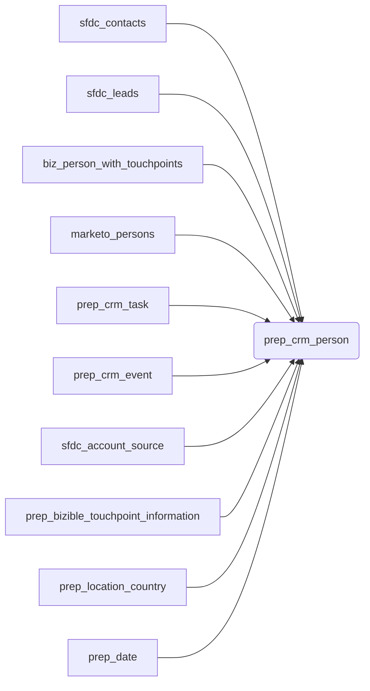

## 4.1. CRM Person Data Preparation

This section delves into the processes and models involved in preparing CRM person data. The core objective is to consolidate information from diverse CRM sources, enriching it with relevant activity and touchpoint details. This prepared data forms the foundation for building the [CRM Person Dimension](chapter_320.md) (`dim_crm_person`) and the [CRM Person Fact](chapter_320.md) (`fct_crm_person`) tables, which are vital for comprehensive marketing and sales analysis.

### Use Case: Understanding Lead Engagement

Imagine a marketing analyst wants to understand the engagement patterns of leads before they become Marketing Qualified Leads (MQLs). To achieve this, the analyst needs a unified view of each lead, encompassing their demographic information, the touchpoints they interacted with, and the key dates in their lifecycle (e.g., created date, MQL date). This information is spread across Salesforce Leads, Contacts, Marketo, and Bizible. The data preparation models discussed below are crucial for bringing this fragmented data together.

### Key Models

The primary model responsible for CRM person data preparation is `prep_crm_person`. Supporting models like `prep_crm_task`, `prep_crm_event`, and `prep_bizible_touchpoint_information` feed into `prep_crm_person`, providing enriched data.

#### 4.1.1. `prep_crm_person`

*   **Purpose:** The `prep_crm_person` model acts as the central hub for consolidating and cleaning person-related data. It unifies raw data from Salesforce Leads and Contacts, enriches it with data from Bizible and Marketo, and incorporates activity and demographic information.

*   **Sources:** This model draws data from a variety of sources:
    *   `sfdc_contacts` (raw): Raw data for contacts from Salesforce.
    *   `sfdc_leads` (raw): Raw data for leads from Salesforce.
    *   `biz_person_with_touchpoints`: Intermediate model combining Bizible person and touchpoint data. This is derived from `sfdc_bizible_touchpoint_source` and `sfdc_bizible_person_source`.
    *   `marketo_persons`: Lead data from Marketo. This is derived from `marketo_lead_source` and `marketo_activity_delete_lead_source`.
    *   `prep_crm_task`: Prepared task data, contributing to the `is_bdr_sdr_worked` flag.
    *   `prep_crm_event`: Prepared event data, also contributing to the `is_bdr_sdr_worked` flag.
    *   `sfdc_account_source`: Raw account data from Salesforce.
    *   `prep_bizible_touchpoint_information`: Provides MQL and recent touchpoint information.
    *   `prep_location_country`: Maps location data to countries.
    *    `prep_date`: Date dimension table, used for date transformations.

*   **Transformations and Logic:** `prep_crm_person` performs a series of transformations, including:
    *   **ID Cleaning and Consolidation:** Standardizes and cleans IDs across different systems (Salesforce, Marketo, Bizible).
    *   **Data Enrichment:** Enriches person records with data from Bizible (touchpoints), Marketo (behavioral data), and other sources.
    *   **Lifecycle Stage Derivation:** Calculates key lifecycle dates (e.g., inquiry date, MQL date) based on event data.
    *   **Demographic Data Incorporation:** Incorporates demographic information from Salesforce and external enrichment tools.
    *   **Activity Flag Calculation:** Calculates the `is_bdr_sdr_worked` flag based on task and event data, indicating whether a BDR/SDR has engaged with the person.

*   **Example Code Snippet:**

 ```sql
 SELECT
  --id
  dim_crm_person_id,
  sfdc_record_id,
  bizible_person_id,
  sfdc_record_type,
  email_hash,
  email_domain,
  IFF(email_domain_type = 'Business email domain',TRUE,FALSE) AS is_valuable_signup,
  ...
 FROM "PROD".common_prep.prep_crm_person
 ```

This snippet shows how `prep_crm_person` selects and transforms data from its source models, creating a unified view of CRM persons.

*   **Output:** The output of `prep_crm_person` is a unified person record, ready for use in the [CRM Person Dimension](chapter_320.md) and [CRM Person Fact](chapter_320.md) tables. The output includes cleaned IDs, demographic information, touchpoint data, and lifecycle dates.

#### 4.1.2. Supporting Person Activity Data

These models process raw task and event data to support flags and metrics in `prep_crm_person`.

*   **`prep_crm_task`:** This model cleans and categorizes raw Salesforce Task data (`sfdc_task_source`), extracting task types, statuses, and performance metrics.

    *   It's used for the `is_bdr_sdr_worked` flag in `prep_crm_person`, indicating whether a BDR or SDR has worked on the lead.

*   **`prep_crm_event`:** This model cleans and categorizes raw Salesforce Event data (`sfdc_event_source`), extracting event types and related entity information.

    *   It also contributes to the `is_bdr_sdr_worked` flag in `prep_crm_person`.

*   **Example Code Snippet:**

```sql
SELECT
  sfdc_record_id,
  MIN(task_completed_date) AS min_task_completed_date_by_bdr_sdr
FROM "PROD".common_prep.prep_crm_task
WHERE is_deleted = 'FALSE'
AND task_owner_role LIKE '%BDR%'
OR task_owner_role LIKE '%SDR%'
GROUP BY 1
```

This snippet shows how `prep_crm_task` aggregates task data to identify BDR/SDR activity.

#### 4.1.3. Bizible Touchpoint Information Prep (`prep_bizible_touchpoint_information`)

*   **Purpose:** This model identifies and consolidates the most recent and MQL-related Bizible touchpoint information for each person. This information is then used to enrich `prep_crm_person`.

*   **Sources:** The model uses the following data sources:
    *   `sfdc_lead_source` (raw): Raw Salesforce Lead data.
    *   `sfdc_contact_source` (raw): Raw Salesforce Contact data.
    *   `sfdc_bizible_person_source` (raw): Raw Bizible Person data.
    *   `sfdc_bizible_touchpoint_source` (raw): Raw Bizible Touchpoint data.

*   **Output:** This model outputs MQL and most recent touchpoint IDs, dates, URLs, campaign names, and marketing channels. These attributes then enrich `prep_crm_person`.

*   **Example Code Snippet:**

```sql
SELECT DISTINCT
    prep_person.sfdc_record_id,
    prep_bizible.touchpoint_id,
    prep_bizible.bizible_touchpoint_date,
    prep_bizible.bizible_form_url,
    prep_bizible.campaign_id AS sfdc_campaign_id,
    ...
FROM prep_person
LEFT JOIN mql_person_prep
    ON prep_person.sfdc_record_id=mql_person_prep.sfdc_record_id
LEFT JOIN prep_bizible
    ON prep_person.bizible_person_id = prep_bizible.bizible_person_id
```

This code snippet shows how `prep_bizible_touchpoint_information` joins data from various sources to identify the most recent and MQL-related touchpoints.

### Data Flow and Dependencies

Here's a simplified representation of the data flow:



This diagram illustrates how `prep_crm_person` integrates data from multiple sources.

### Conclusion

By using these data preparation models, the marketing analyst can now access a comprehensive and unified view of CRM person data. This empowers them to analyze lead engagement patterns, understand the effectiveness of different marketing touchpoints, and ultimately improve marketing strategies. The `prep_crm_person` model, along with its supporting models, provides a robust foundation for building the [CRM Person Dimension](chapter_320.md) and [CRM Person Fact](chapter_320.md) tables.
