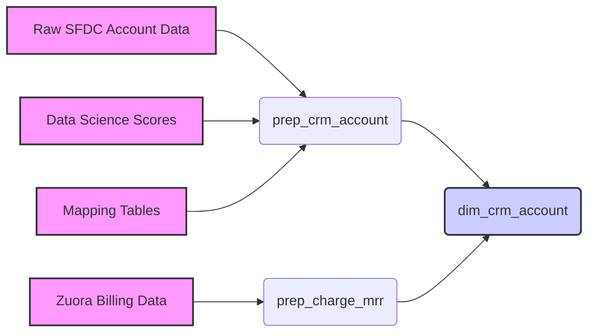

## 4.4. CRM Account Data Preparation

This section delves into the crucial process of preparing CRM account data. CRM account data often resides in different systems and formats. Therefore, data preparation involves consolidating, cleansing, and enriching this data to create a unified and reliable foundation for marketing analysis. This ensures we're working with accurate and consistent information about our accounts.

**Central Use Case:** A marketing analyst wants to identify high-potential accounts for an ABM campaign. To do this, they need to combine basic account information (like industry, size, and location) with health scores and engagement metrics. The data pipeline must bring these disparate sources together accurately.

This chapter will guide you through the models involved in this data preparation, showing how raw data is transformed into usable account dimensions.

The primary tables involved are:

*   `dim_crm_account` (the target dimensional table)
*   `prep_crm_account` (the main preparation model)
*   Supporting `prep` and `map` models (providing key transformations and mappings)

Here's a high-level view:



### 4.4.1. CRM Account Prep (`prep_crm_account`)

This model is the heart of the CRM account data preparation process. It consolidates raw Salesforce Account data with enrichment data from various sources.

*   **Purpose**: To create a single, clean, and enriched record for each CRM account. This involves handling merged accounts, incorporating contact information, user roles, and data science scores.

*   **Source Models**:

    *   `sfdc_account_source` (raw): Raw Salesforce account data.
    *   `map_merged_crm_account` ([Chapter 4.4.3](#443-crm-account-mapping-tables)): Resolves merged account IDs.
    *   `prep_crm_person` ([Chapter 4.1.1](#411-prepcrmperson)): Provides primary contact information.
    *   `sfdc_user_roles_source` (raw): Contains user role data.
    *   `dim_date` ([Chapter 4.7.1](#471-date-dimension-dimdate)): Provides date attributes.
    *   `prep_crm_user` ([Chapter 4.5.1](#451-crm-user-prep-prepcrmuser)): Includes CRM user information.
    *   `sfdc_users_source` (raw): Raw user data.
    *   `sfdc_record_type` (legacy): Record type information (likely deprecated).
    *   `pte_scores_source` ([Chapter 4.4.4](#444-data-science-scores-pte-ptc)): Product Expansion (PTE) scores.
    *   `ptc_scores_source` ([Chapter 4.4.4](#444-data-science-scores-pte-ptc)): Product Contraction (PTC) scores.

*   **Key Transformations**:

    *   **Merging Accounts**: The `map_merged_crm_account` model is used to ensure that all historical data points to the correct, non-merged account ID.
    *   **Enrichment**: Data science scores (PTE and PTC) are incorporated to provide insights into account health and potential.
    *   **Standardization**: Attributes like sales segment and territory are standardized using mapping tables.

*   **Example Code Snippet:**

    ```sql
    SELECT
      -- Primary key
      sfdc_account.account_id AS dim_crm_account_id,
      -- Surrogate keys
      sfdc_account.ultimate_parent_account_id AS dim_parent_crm_account_id,
      -- Descriptive attributes
      sfdc_account.account_name AS crm_account_name,
      sfdc_account.crm_account_billing_country AS crm_account_billing_country,
      -- Data science scores
      pte_scores.score AS pte_score,
      ptc_scores.score AS ptc_score
    FROM sfdc_account
    LEFT JOIN map_merged_crm_account
      ON sfdc_account.account_id = map_merged_crm_account.sfdc_account_id
    LEFT JOIN pte_scores
      ON sfdc_account.account_id = pte_scores.account_id AND pte_scores.is_current = TRUE
    LEFT JOIN ptc_scores
      ON sfdc_account.account_id = ptc_scores.account_id AND ptc_scores.is_current = TRUE
    ```

    This snippet shows how `sfdc_account` is joined with `map_merged_crm_account`, `pte_scores`, and `ptc_scores` to bring together basic attributes and data science insights.

*   **Output**: A comprehensive account dataset ready for the `dim_crm_account`.

### 4.4.2. CRM Account Daily Snapshot Prep (`prep_crm_account_daily_snapshot`)

This model focuses on creating daily historical snapshots of CRM account data. This is essential for time-series analysis and understanding how account attributes change over time.

*   **Purpose**: To capture a daily historical record of CRM account data, enabling trend analysis and cohort creation.

*   **Source Models**:

    *   `sfdc_account_snapshots_source` (legacy): Historical snapshots of Salesforce account data.
    *   `map_merged_crm_account` ([Chapter 4.4.3](#443-crm-account-mapping-tables)): Resolves merged account IDs.
    *   `prep_crm_person` ([Chapter 4.1.1](#411-prepcrmperson)): Provides person data.
    *   `sfdc_user_roles_source` (raw): User role data.
    *   `dim_date` ([Chapter 4.7.1](#471-date-dimension-dimdate)): Date attributes.
    *   `prep_crm_user_daily_snapshot` ([Chapter 4.5.2](#452-crm-user-daily-snapshot-prep-prepcrmuserdailysnapshot)): Daily snapshots of CRM user data.
    *   `sfdc_record_type` (legacy): Record type information (likely deprecated).
    *   `pte_scores_source` ([Chapter 4.4.4](#444-data-science-scores-pte-ptc)): PTE scores.
    *   `ptc_scores_source` ([Chapter 4.4.4](#444-data-science-scores-pte-ptc)): PTC scores.
    *   `driveload_lam_corrections_source` (raw): Manual corrections for LAM (Land-Adopt-Monitor) metrics.

*   **Key Transformations**:

    *   **Snapshot Creation**: Extracts daily snapshots based on the `dbt_valid_from` and `dbt_valid_to` columns.
    *   **LAM Corrections**: Incorporates manual corrections for LAM metrics from the `driveload_lam_corrections_source`.
    *   **Data Stitching**: Merges data from various sources, resolving IDs using mapping tables.

*   **Example Code Snippet**:

    ```sql
    SELECT
      -- Primary key
      sfdc_account_snapshots_source.account_id AS dim_crm_account_id,
      -- Snapshot information
      snapshot_dates.date_id AS snapshot_id,
      snapshot_dates.date_actual AS snapshot_date,
      -- Account attributes
      sfdc_account_snapshots_source.account_name AS crm_account_name,
      sfdc_account_snapshots_source.abm_tier AS abm_tier,
      -- Data science scores
      pte_scores.score AS pte_score,
      ptc_scores.score AS ptc_score
    FROM sfdc_account_snapshots_source
    INNER JOIN snapshot_dates
      ON sfdc_account_snapshots_source.dbt_valid_from::DATE <= snapshot_dates.date_actual
      AND (sfdc_account_snapshots_source.dbt_valid_to::DATE > snapshot_dates.date_actual OR sfdc_account_snapshots_source.dbt_valid_to IS NULL)
    LEFT JOIN pte_scores
      ON sfdc_account_snapshots_source.account_id = pte_scores.account_id
      AND sfdc_account_snapshots_source.snapshot_date >= pte_scores.valid_from::DATE
      AND sfdc_account_snapshots_source.snapshot_date < pte_scores.valid_to::DATE
    LEFT JOIN ptc_scores
      ON sfdc_account_snapshots_source.account_id = ptc_scores.account_id
      AND sfdc_account_snapshots_source.snapshot_date >= ptc_scores.valid_from::DATE
      AND sfdc_account_snapshots_source.snapshot_date < ptc_scores.valid_to::DATE
    ```

    This code demonstrates the core logic of creating daily snapshots by joining the historical account data with a date spine and incorporating PTE/PTC scores relevant for that specific date.

*   **Output**: Daily snapshots of CRM account data for use in trend analysis and cohort creation, feeding into the `dim_crm_account` and `prep_crm_opportunity` models.

### 4.4.3. CRM Account Mapping Tables

These tables play a vital role in standardizing and resolving account-related information.

*   **Purpose**: To provide consistent mappings for CRM account IDs to relevant dimension IDs and to resolve merged account discrepancies. This ensures that data can be joined accurately across fact tables and that analysis is performed on the correct account.

*   **Key Tables**:

    *   **`map_crm_account`**:  This table does the mapping of sales segments, territory, industry and location from accounts to corresponding dimension IDs. Joins the [prep_sfdc_account](chapter_471.md) with [prep_sales_segment](chapter_472.md), [prep_sales_territory](chapter_473.md), [prep_industry](chapter_474.md), and [prep_location_country](chapter_475.md).

    *   **`map_merged_crm_account`**: This table resolves merged Salesforce accounts to their canonical ID. It handles both live (`sfdc_account_source`) and historical (`sfdc_account_snapshots_source`) data.

*   **Example Use Case:** When an account is merged in Salesforce, its ID changes. The `map_merged_crm_account` table allows you to consistently track the account's history under its current, non-merged ID.

*   **Code Snippet (map_merged_crm_account):**

    ```sql
    SELECT
      account_id AS sfdc_account_id,
      master_record_id,
      is_deleted,
      -- Logic to determine the merged account ID
      lineage[ARRAY_SIZE(lineage) - 1]::VARCHAR AS merged_account_id,
      IFF(merged_account_id != account_id, TRUE, FALSE) AS is_merged,
      IFF(is_deleted AND NOT is_merged, TRUE, FALSE) AS deleted_not_merged,
      -- Return final common dimension mapping,
      IFF(deleted_not_merged, '-1', merged_account_id) AS dim_crm_account_id
    FROM recursive_cte
    ```

    This SQL snippet illustrates the recursive CTE used to trace the lineage of merged accounts, ultimately providing the correct `dim_crm_account_id`.

### 4.4.4. Data Science Scores (PTE, PTC)

These raw data sources provide account-level scores from data science models, used for enrichment in account preparation.

*   **Purpose**: To enrich CRM account data with predictive scores indicating the likelihood of product expansion (PTE) or contraction (PTC).

*   **Key Tables**:

    *   **`pte_scores_source`**: Provides Product Expansion (PTE) scores for CRM accounts.
    *   **`ptc_scores_source`**: Provides Product Contraction (PTC) scores for CRM accounts.

*   **Source**: Both are sourced from `RAW.data_science` tables.

*   **Usage**: These scores are incorporated into the `prep_crm_account` and `prep_crm_account_daily_snapshot` models.

*   **Example Data**:

    ```
    -- Example PTE score data
    crm_account_id | score | decile | score_date
    ----------------|-------|--------|------------
    001RM000005XYZ123 | 0.75  | 8      | 2024-01-15

    -- Example PTC score data
    crm_account_id | score | decile | score_date
    ----------------|-------|--------|------------
    001RM000005ABC456 | 0.25  | 3      | 2024-01-15
    ```

### 4.4.5. Charge and MRR Data for Accounts

These models process Zuora billing data to support account metrics and cohorts.

*   **Purpose**: To calculate Monthly Recurring Revenue (MRR) and identify revenue cohorts for accounts.

*   **Key Models**:

    *   **`prep_charge_mrr`**: Calculates MRR based on Zuora charge data and identifies ARR cohorts (`crm_account_arr_cohort_month`, `crm_account_arr_cohort_quarter`) for accounts.
    *   **`prep_charge`**: Consolidates and cleans various Zuora charge-related data for ARR analysis, including manual adjustments.

*   **Data Flow**:

    ```mermaid
    graph LR
    A[Raw Zuora Charge Data] --> B(prep_charge)
    B --> C(prep_charge_mrr)
    C --> D(dim_crm_account)
    ```

*   **`prep_charge` Details**:

    *   **Sources**: Data from various Zuora tables (e.g., `zuora_rate_plan`, `zuora_rate_plan_charge`, `zuora_order`) and joins with `sfdc_account_source`, `zuora_account`, and `map_merged_crm_account`.
    *   **Transformations**: Cleanses and consolidates charge data, handling manual adjustments for ARR analysis.

*   **`prep_charge_mrr` Details**:

    *   **Sources**: `prep_charge` and `prep_date` ([Chapter 4.7.1](#471-date-dimension-dimdate)).
    *   **Calculations**: Calculates MRR and identifies revenue cohorts (`crm_account_arr_cohort_month`, `crm_account_arr_cohort_quarter`) for accounts.

*   **Example Use Case**: To determine the average MRR of accounts acquired in Q1 2023. This requires joining the `dim_crm_account` table with the `prep_charge_mrr` model, filtering by the `crm_account_arr_cohort_quarter`, and aggregating the MRR.

### 4.4.6. `prep_charge`

*   **Purpose**: Consolidates and cleans various Zuora and Zuora Revenue charge-related data for ARR analysis, including manual adjustments.
*   **Sources**: `zuora_rate_plan`, `zuora_rate_plan_charge`, `zuora_order_action_rate_plan`, `zuora_order_action`, `revenue_contract_line`, `zuora_order`, `charge_contractual_value`, `booking_transaction` (all raw `PREP` sources), and joins with `sfdc_account_source`, `zuora_account`, `zuora_subscription` (raw `PREP` sources), and [map_merged_crm_account](chapter_443.md).
