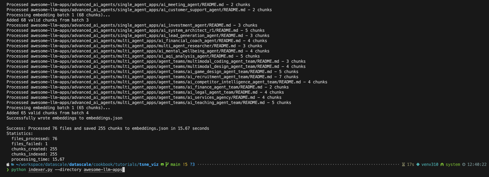
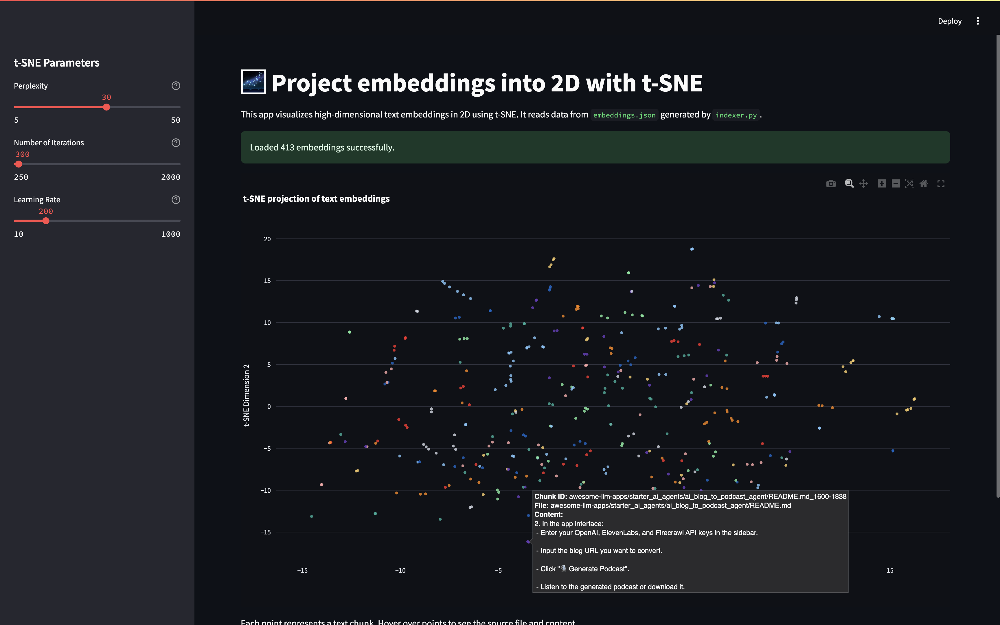
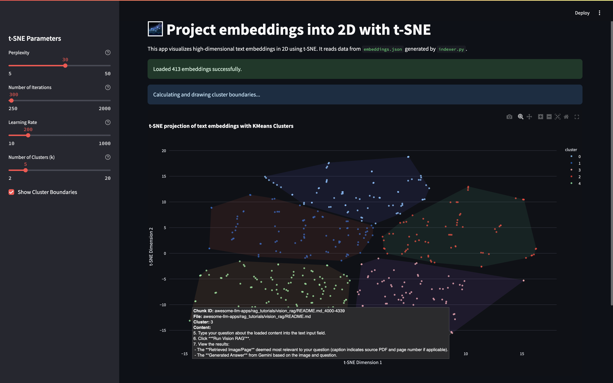

# Embedding Visualization With t-SNE

## How-to

```bash
# source venv/bin/activate

pip install -r requirements.txt
python indexer.py --directory awesome-llm-apps --file-types .md .py
```

## Indexer



### Data structure
```json
{
    "id": "awesome-llm-apps/README.md_0-770",  # <- file chunk
    "file_id": "awesome-llm-apps/README.md",
    "content": "<p align=\"center\">\n  <a href=\"http://www.theunwindai.com\">\n    \n  </a>\n</p>\n\n<p align=\"center\">\n  <a href=\"https://www.linkedin.com/in/shubhamsaboo/\">\n    \n  </a>\n  <a href=\"https://twitter.com/Saboo_Shubham_\">\n    \n  </a>\n</p>\n\n<hr/>\n\n# \ud83c\udf1f Awesome LLM Apps\n\nA curated collection of awesome LLM apps built with RAG and AI agents. This repository features LLM apps that use models from OpenAI, Anthropic, Google, and open-source models like DeepSeek, Qwen or Llama that you can run locally on your computer.",
    "start_pos": 0,
    "end_pos": 770,
    "embedding": [
        0.0073794015,
        -0.028406965,
        -0.032604195,
        0.0019491456,
        ...
    ]
}
```

## Visualizer

## Scatter

```bash
streamlit run viz_scatter.py
```




## Cluster

```bash
streamlit run viz_cluster.py
```




## References
* https://plotly.com/python/t-sne-and-umap-projections/
* https://www.kaggle.com/code/colinmorris/visualizing-embeddings-with-t-sne